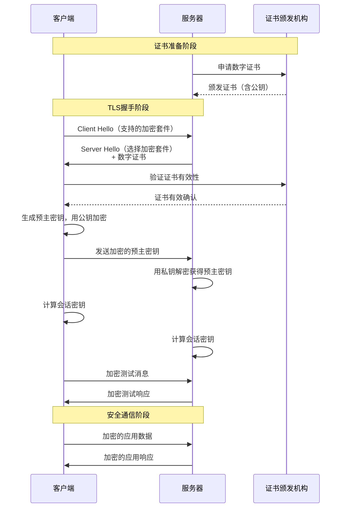

# HTTP 与 HTTPS 的区别详解

## 1. 基本概念对比

| 特性 | HTTP | HTTPS |
|------|------|-------|
| **全称** | HyperText Transfer Protocol（超文本传输协议） | HyperText Transfer Protocol Secure（超文本传输安全协议） |
| **协议基础** | TCP | HTTP over SSL/TLS |
| **默认端口** | 80 | 443 |
| **URL开头** | `http://` | `https://` |
| **安全性** | 明文传输，不安全 | 加密传输，安全 |

## 2. 核心区别详解

### 2.1 安全性（最重要的区别）

#### **HTTP：明文传输，如同明信片**
```http
GET /login HTTP/1.1
Host: example.com
Content-Type: application/x-www-form-urlencoded

username=admin&password=123456
```
- ✅ **所有人可见**：数据在传输过程中完全透明
- ✅ **易被窃取**：路由器、ISP、黑客都可以看到内容
- ✅ **易被篡改**：中间人可以修改请求/响应内容

#### **HTTPS：加密传输，如同密封信件**
```bash
# 实际传输的是这样的加密数据：
TLSv1.2 Record Layer: Handshake Protocol: Client Hello
Content Type: Handshake (22)
Version: TLS 1.2 (0x0303)
Length: 512
Handshake Type: Client Hello (1)
...
Encrypted Application Data: ......
```
- ✅ **加密保护**：数据经过SSL/TLS加密
- ✅ **防止窃听**：只有客户端和服务器能解密
- ✅ **防止篡改**：数字签名确保数据完整性

### 2.2 工作原理对比

#### **HTTP 工作流程**
```
客户端 → 明文请求 → 服务器
客户端 ← 明文响应 ← 服务器
```
**风险**：
- 中间人可以看到所有数据
- 无法验证服务器身份
- 数据可能被修改

#### **HTTPS 工作流程**
```
1. 客户端发起HTTPS请求
2. SSL/TLS握手
   - 协商加密算法
   - 验证服务器证书
   - 交换会话密钥
3. 使用会话密钥加密通信
4. 传输加密数据
```

### 2.3 SSL/TLS 握手过程详解



## 3. 技术实现细节

### 3.1 HTTPS 使用的加密技术

#### **对称加密**（用于数据传输）
```javascript
// 会话密钥加密（快速高效）
const sessionKey = "随机生成的密钥";
const encryptedData = AES_encrypt(plainText, sessionKey);
// 客户端和服务器使用相同的密钥加解密
```

#### **非对称加密**（用于密钥交换）
```javascript
// 服务器拥有密钥对
const serverPublicKey = "公钥（公开）";
const serverPrivateKey = "私钥（保密）";

// 客户端用公钥加密预主密钥
const encryptedPreMasterKey = RSA_encrypt(preMasterKey, serverPublicKey);

// 服务器用私钥解密
const preMasterKey = RSA_decrypt(encryptedPreMasterKey, serverPrivateKey);
```

#### **数字证书和CA机构**
```bash
# 查看网站证书信息
openssl s_client -connect github.com:443 -servername github.com

# 证书包含：
# - 域名信息
# - 公钥
# - 颁发机构(CA)签名
# - 有效期
```

### 3.2 HTTP/2 与 HTTPS 的关系
```bash
# HTTP/2 几乎总是基于 HTTPS
# 因为：
# 1. 主流浏览器只支持加密的HTTP/2
# 2. HTTPS提供必要的安全基础

# 检查网站协议
curl -I https://example.com
# 返回：HTTP/2 200  # 表示使用HTTP/2 over HTTPS
```

## 4. 性能比较

### 4.1 HTTPS 的性能开销
```javascript
// 传统观点：HTTPS慢，因为：
1. SSL/TLS握手延迟（增加1-2个RTT）
2. 加解密计算开销（CPU占用）
3. 证书验证时间

// 现代优化：
1. TLS 1.3减少握手时间（1个RTT → 0个RTT）
2. 会话恢复（Session Resumption）
3. OCSP Stapling减少证书验证时间
4. 硬件加速（AES-NI指令集）
```

### 4.2 实际性能对比（2024年数据）

| 指标 | HTTP | HTTPS（优化后） | 差距 |
|------|------|-----------------|------|
| 首次连接延迟 | 低 | 略高（TLS握手） | 50-100ms |
| 后续连接延迟 | 低 | 接近HTTP（会话恢复） | <10ms |
| 数据传输速度 | 快 | 接近HTTP（HTTP/2多路复用） | 基本持平 |
| CPU占用 | 低 | 较高（但现代CPU可忽略） | 1-2% |

### 4.3 性能优化技术

#### **TLS 会话恢复**
```nginx
# Nginx配置
ssl_session_cache shared:SSL:50m;
ssl_session_timeout 1d;
ssl_session_tickets on;
```

#### **OCSP Stapling**
```nginx
ssl_stapling on;
ssl_stapling_verify on;
resolver 8.8.8.8 8.8.4.4 valid=300s;
```

#### **HTTP/2 多路复用**
```javascript
// HTTP/1.1: 每个请求需要独立的TCP连接（队头阻塞）
// HTTP/2: 单个连接上多路复用多个请求
```

## 5. SEO 和用户体验影响

### 5.1 Google 的立场
```markdown
2014年：HTTPS作为排名信号
2016年：提升HTTPS网站的权重
2018年：Chrome标记HTTP网站为"不安全"
2021年：页面体验更新，HTTPS成为核心要求
2024年：HTTP/3 over QUIC要求HTTPS
```

### 5.2 浏览器行为差异

#### **Chrome/Firefox/Safari的警告**
```html
<!-- HTTP网站会显示 -->
🔓 不安全 | http://example.com

<!-- HTTPS网站会显示 -->
🔒 https://example.com | 连接是安全的
```

#### **现代Web API要求HTTPS**
```javascript
// 以下API只能在HTTPS环境中使用：
// 1. 地理位置API
navigator.geolocation.getCurrentPosition()

// 2. 相机/麦克风访问
navigator.mediaDevices.getUserMedia()

// 3. Service Workers
navigator.serviceWorker.register()

// 4. 推送通知
PushManager.subscribe()

// 5. 支付请求API
new PaymentRequest()
```

## 6. 实际部署示例

### 6.1 获取SSL证书的途径

| 类型 | 提供商 | 特点 | 适用场景 |
|------|--------|------|----------|
| 免费证书 | Let's Encrypt | 自动化，90天有效期 | 个人网站、测试环境 |
| 域名验证(DV) | Comodo, DigiCert | 验证域名所有权 | 博客、中小网站 |
| 组织验证(OV) | Symantec, GlobalSign | 验证组织信息 | 企业官网 |
| 扩展验证(EV) | 各大CA | 绿色地址栏，最高信任 | 银行、电商 |

### 6.2 Nginx 配置示例
```nginx
server {
    listen 80;
    server_name example.com;
    
    # 强制重定向到HTTPS
    return 301 https://$server_name$request_uri;
}

server {
    listen 443 ssl http2;
    server_name example.com;
    
    # SSL证书配置
    ssl_certificate /etc/nginx/ssl/example.com.crt;
    ssl_certificate_key /etc/nginx/ssl/example.com.key;
    
    # 现代SSL配置
    ssl_protocols TLSv1.2 TLSv1.3;
    ssl_ciphers ECDHE-RSA-AES256-GCM-SHA512:DHE-RSA-AES256-GCM-SHA512;
    ssl_prefer_server_ciphers off;
    
    # HSTS（强制HTTPS）
    add_header Strict-Transport-Security "max-age=31536000; includeSubDomains" always;
    
    # 其他安全头
    add_header X-Frame-Options DENY;
    add_header X-Content-Type-Options nosniff;
    add_header X-XSS-Protection "1; mode=block";
    
    # 网站内容
    root /var/www/html;
    index index.html;
}
```

### 6.3 Node.js/Express 配置
```javascript
const https = require('https');
const fs = require('fs');
const express = require('express');
const app = express();

// 读取证书文件
const options = {
    key: fs.readFileSync('/path/to/private.key'),
    cert: fs.readFileSync('/path/to/certificate.crt'),
    ca: fs.readFileSync('/path/to/ca_bundle.crt'),
    
    // 启用HTTP/2
    allowHTTP1: true
};

// 强制HTTPS中间件
app.use((req, res, next) => {
    if (!req.secure && req.get('X-Forwarded-Proto') !== 'https') {
        return res.redirect(`https://${req.headers.host}${req.url}`);
    }
    next();
});

// 创建HTTPS服务器
https.createServer(options, app).listen(443, () => {
    console.log('HTTPS server running on port 443');
});

// 可选：HTTP服务器用于重定向
const http = require('http');
http.createServer((req, res) => {
    res.writeHead(301, { Location: `https://${req.headers.host}${req.url}` });
    res.end();
}).listen(80);
```

### 6.4 自动化证书管理（Certbot）
```bash
# 安装Certbot
sudo apt-get install certbot python3-certbot-nginx

# 获取并安装证书
sudo certbot --nginx -d example.com -d www.example.com

# 设置自动续期（Let's Encrypt证书90天有效期）
sudo crontab -e
# 添加：0 12 * * * /usr/bin/certbot renew --quiet
```

## 7. 混合内容和常见问题

### 7.1 混合内容警告
```html
<!-- 问题：HTTPS页面加载HTTP资源 -->
<script src="http://cdn.example.com/jquery.js"></script>


<!-- 浏览器行为 -->
✅ 阻塞：脚本、样式、iframe（主动混合内容）
⚠️ 允许但警告：图片、音视频（被动混合内容）
```

### 7.2 解决方案
```html
<!-- 方案1：使用协议相对URL（已不推荐） -->
<script src="//cdn.example.com/jquery.js"></script>

<!-- 方案2：强制使用HTTPS -->
<script src="https://cdn.example.com/jquery.js"></script>

<!-- 方案3：内容安全策略（CSP） -->
<meta http-equiv="Content-Security-Policy" 
      content="upgrade-insecure-requests">
```

### 7.3 常见错误排查
```bash
# 检查SSL证书
openssl s_client -connect example.com:443 -servername example.com

# 检查SSL配置评分
curl https://www.ssllabs.com/ssltest/analyze.html?d=example.com

# 检查HTTP/2支持
curl -I --http2 https://example.com

# 检查证书链
openssl x509 -in certificate.crt -text -noout
```

## 8. 未来趋势：HTTP/3 和 QUIC

### 8.1 HTTP/3 over QUIC
```javascript
// HTTP/3特点：
1. 基于UDP而非TCP
2. 内置TLS 1.3（强制加密）
3. 改进的多路复用
4. 更好的移动网络支持

// 检测HTTP/3支持
if (performance.getEntriesByType('navigation')[0]?.nextHopProtocol === 'h3') {
    console.log('使用HTTP/3');
}
```

### 8.2 零信任架构
```
传统模型：防火墙保护内部网络
零信任模型：每个请求都验证身份，无论内外
HTTPS作用：提供端到端加密，支持零信任
```

## 9. 总结对比表

| 方面 | HTTP | HTTPS |
|------|------|-------|
| **安全性** | ❌ 明文传输，易被窃听篡改 | ✅ 端到端加密，防窃听防篡改 |
| **数据完整性** | ❌ 无法保证 | ✅ 数字签名保证 |
| **身份验证** | ❌ 无法验证服务器身份 | ✅ 证书验证服务器身份 |
| **SEO影响** | ❌ 排名劣势，可能被降权 | ✅ 排名优势，Google推荐 |
| **用户信任** | ❌ 浏览器标记"不安全" | ✅ 显示安全锁图标 |
| **性能** | ✅ 无加密开销 | ⚠️ 轻微开销（现代可忽略） |
| **现代API** | ❌ 许多API不可用 | ✅ 完整API支持 |
| **合规要求** | ❌ 不符合GDPR等法规 | ✅ 符合数据保护法规 |
| **部署成本** | ✅ 免费 | ⚠️ 证书成本（有免费选项） |
| **未来兼容** | ❌ 逐渐被淘汰 | ✅ HTTP/2、HTTP/3的基础 |

## 10. 最佳实践建议

1. **所有网站都应使用HTTPS**，无例外
2. **使用Let's Encrypt获取免费证书**
3. **启用HSTS防止降级攻击**
4. **定期更新证书和SSL配置**
5. **监控混合内容问题**
6. **考虑启用HTTP/2或HTTP/3**
7. **使用Qualys SSL Labs测试配置**
8. **备份证书和私钥**
9. **设置证书自动续期**
10. **教育团队了解HTTPS重要性**

## 11. 迁移到HTTPS的步骤

1. 购买或获取SSL证书
2. 在服务器安装证书
3. 配置强制HTTPS重定向
4. 更新所有内部链接为HTTPS
5. 更新CDN、第三方服务配置
6. 提交新的sitemap到搜索引擎
7. 监控301重定向链
8. 设置HSTS头
9. 更新Google Search Console
10. 全面测试网站功能
