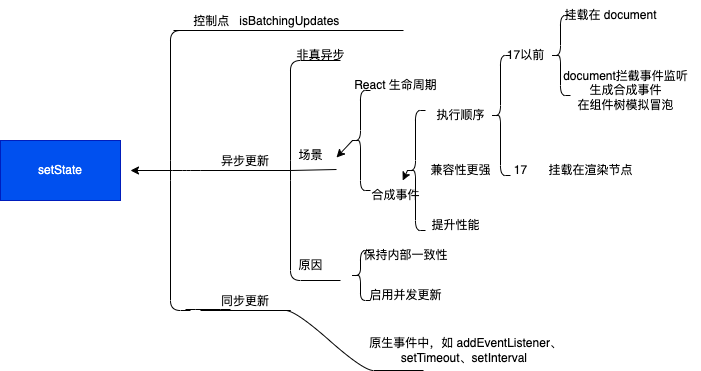

# 面试题汇总 - React 篇（2024）

* 解释 React 是什么？谈一谈对 react 的理解?
  * 概念：React 是一个网页 UI 框架，通过组件化的方式解决视图层开发复用的问题，本质是一个组件化框架
  * 核心思路：声明式、组件化、通用型
    * 声明式有事在于直观与组合
    * 组件化的优势在于试图的拆分与模块的复用，可以更容易做到高内聚低耦合
    * 通用型在于一次学习，随处编写。比如 React Native， React 360 等，这里主要靠虚拟 DOM 来实现。这使得 React 的适用范围也变得足够广，无论是Web、Native、VR、甚至 Shell 应用都可以进行开发。但作为一个视图层的框架，React 的劣势也变得十分明显。它没有提供完整的一揽子解决方案，在开发大型前端应用时，需要向社区寻找并整合解决方案。虽然一定程度上促进了社区的繁荣。但也为开发者在技术选型和学习适用上造成了一定的成本。
  * 可以再谈一下自己对 React 优化的看法、对虚拟 DOM 的看法
----

* 为什么 React 要用 JSX?
  * 什么是 JSX：JavaScript 的语法拓展，结构类似 XML，主要用于声明 React 元素，但 React 中并不强制使用 JSX，即便使用了也会在构建的过程中通过 bebel 插件编译为 React.CreateElement， JSX 更像是构建 React.CreateElement 的语法糖。
  * 模板【弱关注度分离 + 引入概念多】
  * 模板字符串【结构描述复杂 + 语法提示差】
  * JXON 【语法提示差】
----

* Babel 插件如何实现 JSX 到 JS 的编译？
----

* React 生命周期相关
  * 函数组件：任何情况下都会重新渲染，没有生命周期，官方提供React.memo优化手段
  * 类组件： state 发生变化重新渲染；父组件 props 传入时发生变化，不管 props 有没有更新； PureComponent 默认实现了 ShouldComponentUpdate 函数，仅在 props 与  state 进行浅比较后，确认有变更时才重新渲染。
  * Tips: getDerivedStateFromError 能够更新 state，发生错误时使下一次渲染能够显示降级后的 UI 
----

* 类组件与函数组件有什么区别
 * 共同点：作为基础组件展示 UI
 * 不同点：
   * OOP 和 FP
   * 类独有生命周期
   * 类用 shouldComponentUpdate 阻断渲染提示性能，而函数组件用 React.memo 来缓存渲染结果 
----

* 如何设计 React 组件？
  * 设计分类
    * 展示组件
      * 代理组件
      * 样式组件 
      * 布局组件
    * 灵巧组件
      * 容器组件
      * 高阶组件 优点：逻辑复用，链式调用，渲染劫持。缺点：丢失静态函数，refs 属性不能透传
  * 工程实践
    * 目录结构划分
    * 引入工程管理
----

* setState 是同步更新还是异步更新？
> setState 用于变更状态，触发组件重新渲染，更新视图 UI
 
````
class Test extends React.Component {
 state  = {
     count: 0
 };
   componentDidMount() {
   this.setState({count: this.state.count + 1});
   console.log(this.state.count);
   this.setState({count: this.state.count + 1});
   console.log(this.state.count);
    setTimeout(() => {
        this.setState({count: this.state.count + 1});
        console.log(this.state.count);
        this.setState({count: this.state.count + 1});
        console.log(this.state.count);
    }, 0);
 }
 render() {
   return null;
 }
};
输出结果： 0 0 2 3
````
** setState 是同步还是异步的的核心关键是： 更新队列 **

----

* 如何面向组件跨层级通信
