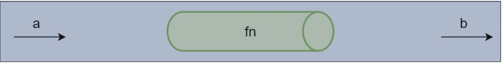
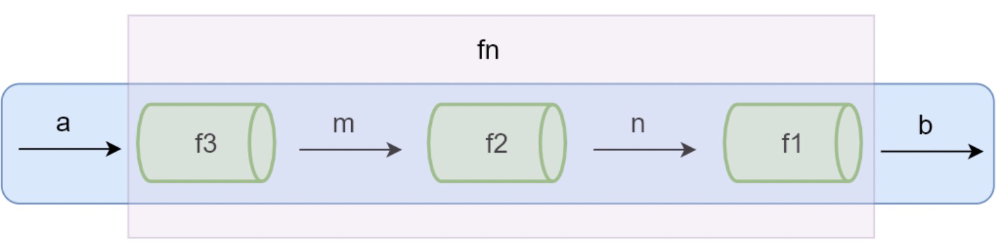

### 函数组合

---

* 纯函数和柯里化很容易写出洋葱代码 h(g(f(x)))
  * 获取数组的最后一个元素再转换成大写字母， _.toUpper(_.first(_.reverse(array)))

* 函数组合可以让我们把细粒度的函数重新组合生成一个新的函数

#### 管道

下面这张图表示程序中使用函数处理数据的过程，给 fn 函数输入参数 a，返回结果 b。可以想想 a 数据

通过一个管道得到了 b 数据。



当 fn 函数比较复杂的时候，我们可以把函数 fn 拆分成多个小函数，此时多了中间运算过程产生的 m 和 

n。

下面这张图中可以想象成把 fn 这个管道拆分成了3个管道 f1, f2, f3，数据 a 通过管道 f3 得到结果 m，m

再通过管道 f2 得到结果 n，n 通过管道 f1 得到最终结果 b 



```javascript
fn = compose(f1, f2, f3) 
b = fn(a)
```

#### **函数组合**

* 函数组合 (compose)：如果一个函数要经过多个函数处理才能得到最终值，这个时候可以把中间

  过程的函数合并成一个函数

  * 函数就像是数据的管道，函数组合就是把这些管道连接起来，让数据穿过多个管道形成最终结果
  * **函数组合默认是从右到左执行**

```javascript
// 组合函数
function compose (f, g) {
  return function (x) {
    return f(g(x)) 
  } 
}
function first (arr) { 
  return arr[0] 
}
function reverse (arr) {
  return arr.reverse() 
}
// 从右到左运行 
let last = compose(first, reverse) 
console.log(last([1, 2, 3, 4]))
```

* lodash 中的组合函数
* lodash 中组合函数 flow() 或者 flowRight()，他们都可以组合多个函数
* flow() 是从左到右运行
* **flflowRight()** 是从右到左运行，使用的更多一些

```javascript
const _ = require('lodash')
const toUpper = s => s.toUpperCase()
const reverse = arr => arr.reverse()
const first = arr => arr[0]
const f = _.flowRight(toUpper, first, reverse)
console.log(f(['one', 'two', 'three']))
```

* 模拟实现 lodash 的 flowRight 方法

```javascript
// 多函数组合
function compose (...fns) {
  return function (value) {
    return fns.reverse().reduce(function (acc, fn) {
      return fn(acc) }, value) 
  } 
}

// ES6
const compose = (...fns) => value => fns.reverse().reduce((acc, fn) => fn(acc), value)
```

* 函数的组合要满足**结合律** (associativity)：
  * 我们既可以把 g 和 h 组合，还可以把 f 和 g 组合，结果都是一样的

```javascript
// 结合律（associativity）
let f = compose(f, g, h) 
let associative = compose(compose(f, g), h) == compose(f, compose(g, h)) 
// true
```


### Functor (函子)

#### **为什么要学函子** 

到目前为止已经已经学习了函数式编程的一些基础，但是我们还没有演示在函数式编程中如何把副作用

控制在可控的范围内、异常处理、异步操作等。

#### **什么是** **Functor**

* 容器：包含值和值的变形关系(这个变形关系就是函数)

* 函子：是一个特殊的容器，通过一个普通的对象来实现，该对象具有 map 方法，map 方法可以运

  行一个函数对值进行处理(变形关系)

#### **Functor** **函子**

```javascript
// 一个容器，包裹一个值
class Container {
  // of 静态方法，可以省略 new 关键字创建对象
  static of (value) {
    return new Container(value) 
  }
  constructor (value) { this._value = value }
  // map 方法，传入变形关系，将容器里的每一个值映射到另一个容器 
  map (fn) { 
    return Container.of(fn(this._value))
  }
}

// 测试 
Container.of(3) 
  .map(x => x + 2) 
  .map(x => x * x)
// Container {_value: 25}
```

* 总结

  * 函数式编程的运算不直接操作值，而是由函子完成

  * 函子就是一个实现了 map 契约的对象

  * 我们可以把函子想象成一个盒子，这个盒子里封装了一个值

  * 想要处理盒子中的值，我们需要给盒子的 map 方法传递一个处理值的函数（纯函数），由这

    个函数来对值进行处理

  * 最终 map 方法返回一个包含新值的盒子（函子）

* 在 Functor 中如果我们传入 null 或 undefifined 

```javascript
// 值如果不小心传入了空值(副作用)
Container.of(null) 
  .map(x => x.toUpperCase())
// TypeError: Cannot read property 'toUpperCase' of null
```


#### **MayBe** **函子**

* 我们在编程的过程中可能会遇到很多错误，需要对这些错误做相应的处理
* MayBe 函子的作用就是可以对外部的空值情况做处理（控制副作用在允许的范围）

```javascript
class MayBe {
  static of (value) {
    return new MayBe(value) 
  }
  constructor (value) {
    this._value = value 
  }
  // 如果对空值变形的话直接返回 值为 null 的函子
  map (fn) {
    return this.isNothing() ? MayBe.of(null) : MayBe.of(fn(this._value)) 
  }
  isNothing () {
    return this._value === null || this._value === undefined 
  } 
}
// 传入具体值 
MayBe.of('Hello World') 
  .map(x => x.toUpperCase()) 
// 传入 null 的情况 
MayBe.of(null) 
  .map(x => x.toUpperCase()) 
// => MayBe { _value: null }
```

* 在 MayBe 函子中，我们很难确认是哪一步产生的空值问题，如下例

```javascript
MayBe.of('hello world') 
  .map(x => x.toUpperCase()) 
  .map(x => null) 
  .map(x => x.split(' ')) 
// => MayBe { _value: null }
```


#### **Either** **函子** 

* Either 两者中的任何一个，类似于 if...else...的处理
* 异常会让函数变的不纯，Either 函子可以用来做异常处理

```javascript
class Left {
  static of (value) {
    return new Left(value) 
  }
  constructor (value) {
    this._value = value 
  }
  map (fn) {
    return this 
  } 
}
class Right {
  static of (value) {
    return new Right(value) 
  }
  constructor (value) {
    this._value = value 
  }
  map(fn) {
    return Right.of(fn(this._value))
  } 
}
```

* Either 用来处理异常

```javascript
function parseJSON(json) {
  try {
    return Right.of(JSON.parse(json)); 
  } catch (e) {
    return Left.of({ error: e.message}); 
  } 
}
let r = parseJSON('{ "name": "zs" }') 
					.map(x => x.name.toUpperCase()) 
console.log(r)
```


#### **IO** **函子**

* IO 函子中的 _value 是一个函数，这里是把函数作为值来处理

* IO 函子可以把不纯的动作存储到 _value 中，延迟执行这个不纯的操作(惰性执行)，包装当前的操

作纯

* 把不纯的操作交给调用者来处理

```javascript
const fp = require('lodash/fp')
class IO {
  static of (x) {
    return new IO(function () { 
      return x 
    }) 
  }
  constructor (fn) {
    this._value = fn 
  }
  map (fn) { 
    // 把当前的 value 和 传入的 fn 组合成一个新的函数 
    return new IO(fp.flowRight(fn, this._value)) 
  } 
}
let io = IO.of(process).map(p => p.execPath) 
console.log(io._value())
```


[函数式编程指北](https://llh911001.gitbooks.io/mostly-adequate-guide-chinese/content/)

[**Functors, Applicatives, And Monads In Pictures**](https://adit.io/posts/2013-04-17-functors,_applicatives,_and_monads_in_pictures.html)